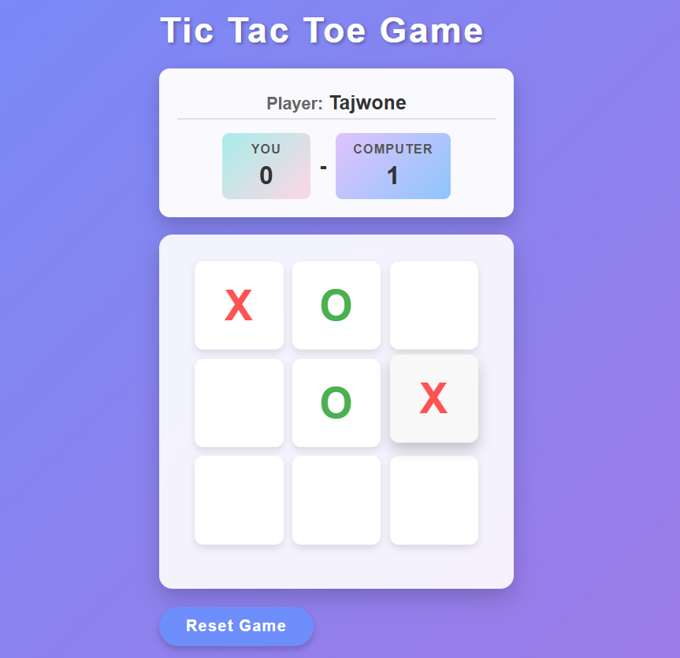

# Tic Tac Toe with AI

A classic Tic Tac Toe game where you play against an unbeatable AI opponent using the Minimax algorithm.

## How to Run the Game

1. **Download the files**: Ensure you have all the game files in the correct folder structure:

   - `index.html` (main file)
   - `css/style.css` (styling)
   - `js/app.js` (core game logic)
   - `js/game.js` (game management)
   - `js/ai.js` (AI implementation)

2. **Open the HTML file**: Double-click on `index.html` to open it in your web browser

3. **Start playing**: The game will load automatically and prompt you to enter your name

## Prerequisites

**No installation required!** This game runs entirely in your web browser using:

- **HTML5** for the structure
- **CSS3** for styling and animations
- **Vanilla JavaScript** for game logic and AI

**Browser Requirements:**

- Any modern web browser (Chrome, Firefox, Safari, Edge)
- JavaScript enabled (enabled by default in most browsers)

## How to Play

1. **Enter Your Name**: When the game loads, enter your name in the prompt dialog
2. **Make Your Move**: You play as "X" - click on any empty cell to place your mark
3. **AI Response**: The computer plays as "O" and will automatically make its move after you
4. **Win Condition**: Get three of your marks in a row (horizontal, vertical, or diagonal) to win
5. **Score Tracking**: Your wins vs AI wins are displayed at the top of the screen
6. **Game Controls**:
   - **Reset Game**: Start a new round (keeps the same scores)
   - **New Game**: Start completely fresh (resets scores)

**Controls:**

- **Mouse Click**: Click on empty cells to make moves
- **Reset Button**: Clear the current game
- **New Game Button**: Start over with fresh scores

## Algorithms Used

This game implements several important algorithms and programming concepts:

1. **Minimax Algorithm**:

   - **Purpose**: Ensures the AI makes optimal moves
   - **How it works**: Recursively evaluates all possible future game states
   - **Result**: The AI is unbeatable - best you can achieve is a draw
   - **Time Complexity**: O(b^d) where b is branching factor and d is depth

2. **Game Tree Search**:

   - **Depth-First Search**: Explores game states recursively
   - **Backtracking**: Undoes moves to explore other possibilities
   - **Alpha-Beta Pruning**: Could be added for optimization (not implemented here)

3. **Game State Management**:

   - **State Representation**: 1D array representing the 3x3 board
   - **Win Detection**: Pattern matching against winning combinations
   - **Turn Management**: Alternates between human and AI players

4. **Event-Driven Programming**:
   - **DOM Event Handling**: Responds to user clicks
   - **Asynchronous Updates**: Updates UI based on game state changes

---

### Main Game Interface

_The main game interface showing the 3x3 grid with X's and O's in play_

### Key Features Shown

- **Clean Interface**: Simple, intuitive design with clear visual feedback
- **Score Tracking**: Player vs AI score display at the top
- **Interactive Grid**: Responsive 3x3 board with hover effects
- **Game Controls**: Reset and New Game buttons for easy game management
- **Visual Indicators**: Clear marking of X (player) and O (AI) moves
- **Status Updates**: Real-time feedback on game state and turn information

_Note: Screenshots are stored in the `Screenshots` folder within the project directory._

---

**For detailed implementation guide and code explanations, see [DETAILED_GUIDE.md](DETAILED_GUIDE.md)**
